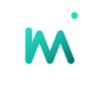
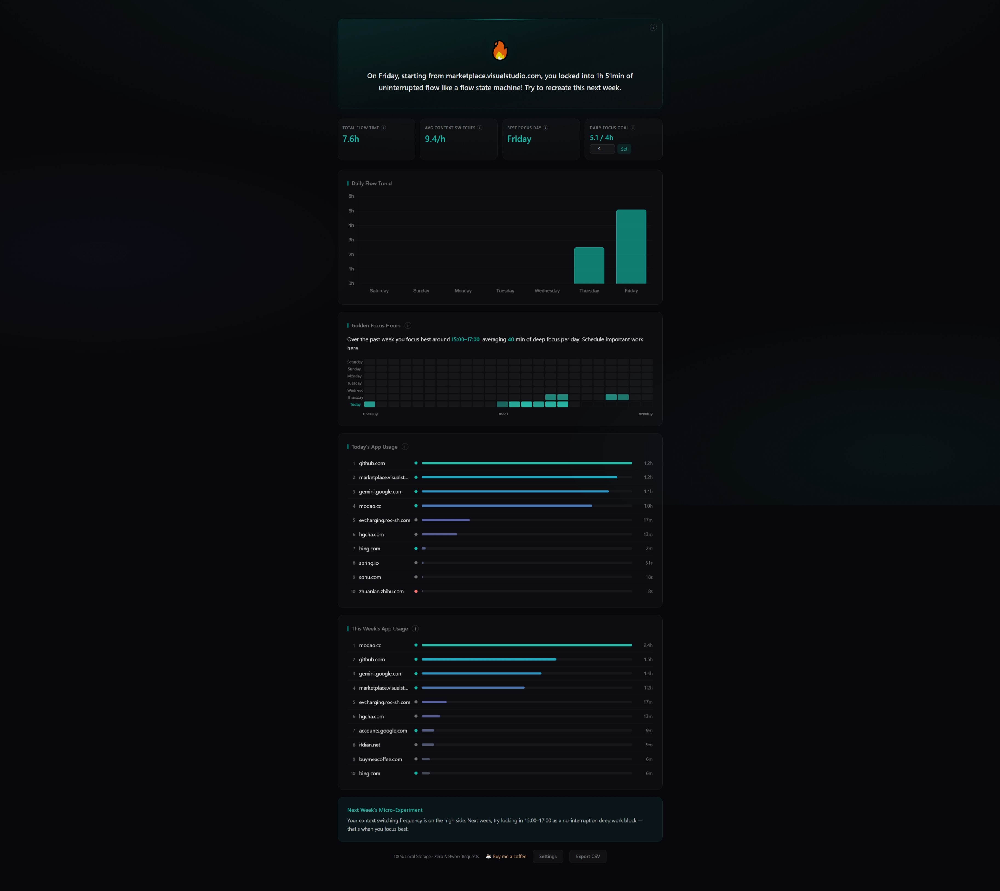
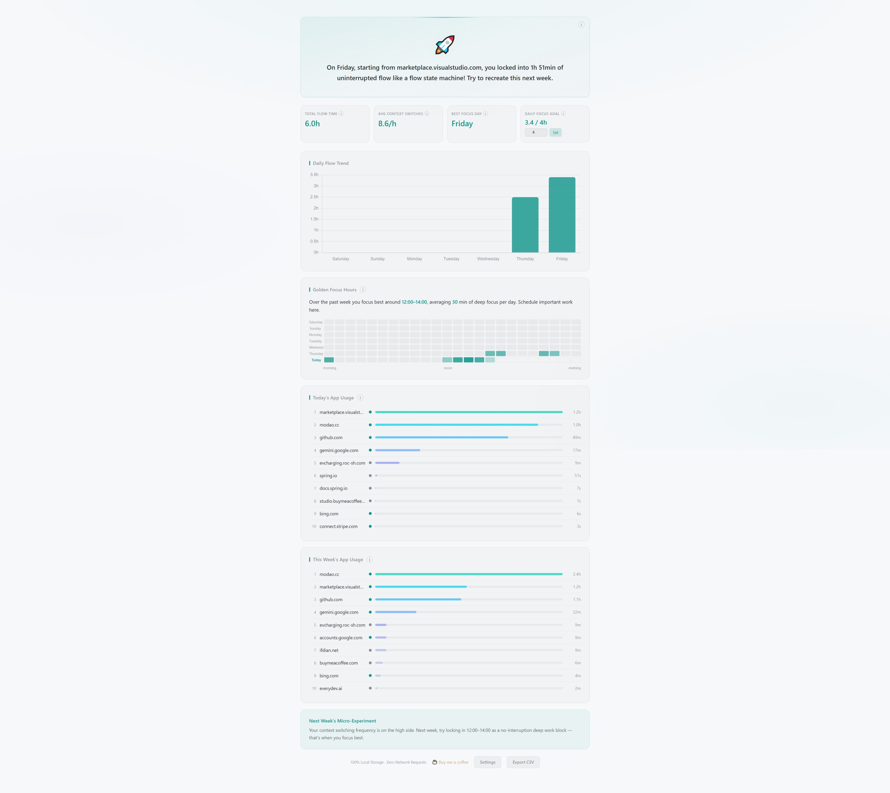
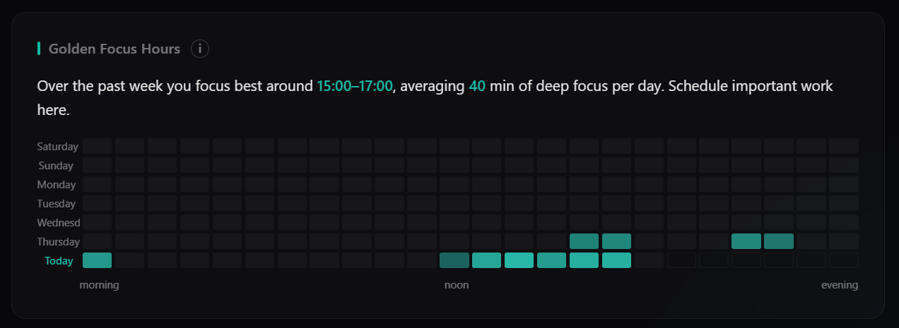
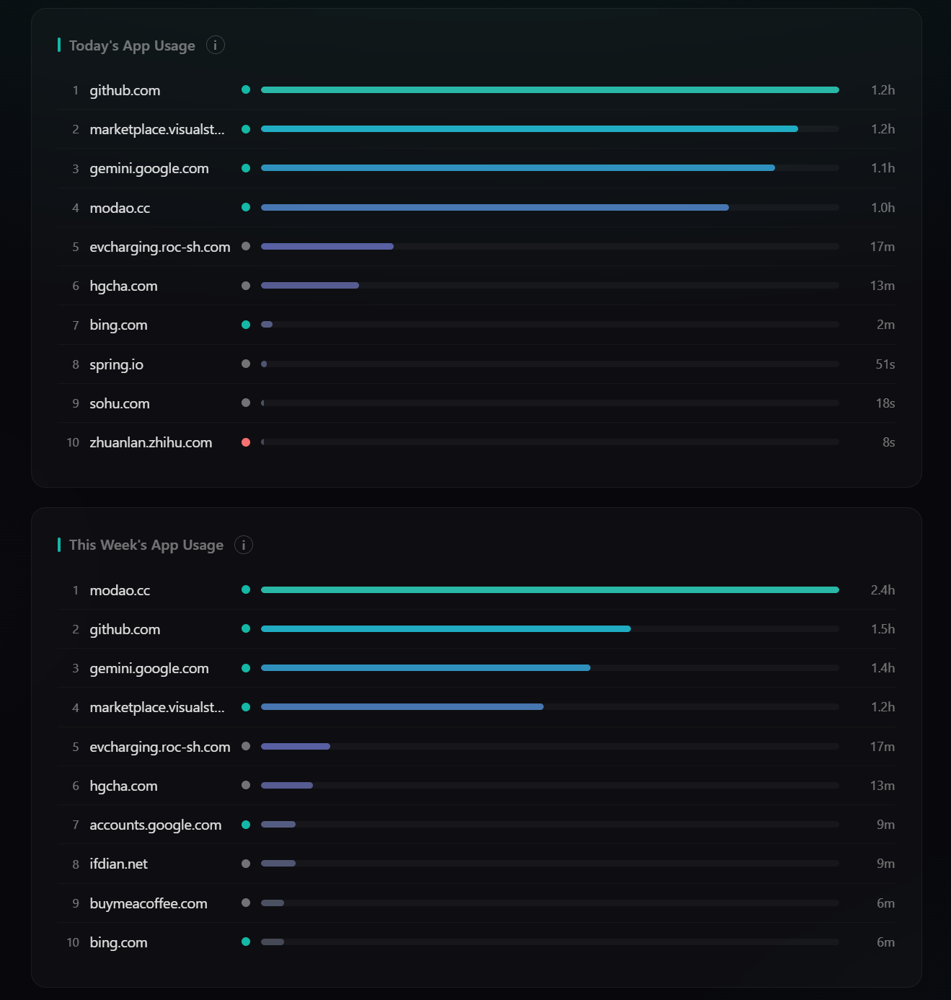

<div align="center">
  

  # TimeWise

  **Your browser time cardiogram — a privacy-first, local-only focus tracker.**

  TimeWise turns your browsing into a "flow cardiogram": it surfaces your deep-focus
  streaks, golden focus hours, and context-switching habits — without sending a
  single byte off your machine.

  `Manifest V3` · `100% local storage` · `Zero network requests`
</div>

---

## Screenshots

<div align="center">
  
  
  <br>
  <em>The dashboard follows your OS appearance — dark (left) and light (right).</em>
</div>

<div align="center">
  
  <br>
  <em>Golden focus hours — a 7-day × 24-hour heatmap of when your deep focus peaks.</em>
</div>

<div align="center">
  
  <br>
  <em>App rankings, color-coded by category.</em>
</div>
---

## Why

Most time trackers either ship your activity to a cloud dashboard or guilt-trip you
with raw screen-time totals. TimeWise does neither. It runs entirely in your browser,
stores everything in local IndexedDB, and frames your data around **flow** — the
uninterrupted stretches where you actually do your best work.

## Features

- **Flow cardiogram** — your longest unbroken focus streak, which can span multiple
  tools (docs → GitHub → localhost) as one continuous session.
- **Golden focus hours** — a 7-day × 24-hour heatmap showing when your deep focus
  actually peaks, so you can schedule important work there.
- **App/domain rankings** — daily and weekly, color-coded by category
  (productive / distracting / unclassified).
- **Daily focus goal** — set a target and track today's focused hours against it.
- **Weekly micro-experiments** — one small, personalized suggestion each week based
  on your real patterns.
- **Light & dark themes** — follows your OS appearance automatically
  (`prefers-color-scheme`).
- **CSV export** — your data is yours; take it anywhere.
- **Bilingual** — English and 简体中文.

## Privacy

This is the whole point, so to be explicit:

- **No network requests.** TimeWise never contacts any server. (The only outbound
  link is an optional "buy me a coffee" link you choose to click.)
- **All data stays in your browser**, in local IndexedDB.
- **No accounts, no telemetry, no analytics.**
- Events older than 90 days are auto-pruned.

You can verify all of the above by reading the source — it's deliberately small.

## Install (load unpacked)

TimeWise isn't on the Chrome Web Store yet. To run it locally:

1. Clone or download this repository.
2. Open `chrome://extensions` in Chrome (or any Chromium browser).
3. Enable **Developer mode** (top-right toggle).
4. Click **Load unpacked** and select the project's root folder
   (the one containing `manifest.json`).
5. Click the TimeWise icon to open your dashboard.

The badge on the icon shows today's focused hours once you've browsed a bit.

## Permissions

TimeWise requests only what it needs to measure focus locally:

| Permission | Why |
|------------|-----|
| `tabs` | Read the active tab's domain to attribute focus time |
| `storage` | Persist events and settings in local storage |
| `idle` | Detect when you step away so idle time isn't counted as focus |
| `alarms` | Schedule periodic badge refresh and the distraction check |
| `notifications` | Optional "time check" nudges when you linger on distracting sites |

There is **no** `host_permissions` for reading page content — TimeWise only ever
looks at the tab's domain, never what's on the page.

## Architecture

Plain vanilla JS, no framework, no build step for the app itself:

```
manifest.json          MV3 manifest
background.js          Service worker: tab/idle tracking, badge, notifications
lib/
  tracker.js           Session start/heartbeat/settle state machine
  classifier.js        Domain -> category (productive / distracting)
  aggregator.js        Builds the weekly report (flow, golden hours, rankings)
  db.js                IndexedDB access (via Dexie)
  dexie.mjs            Bundled Dexie
  chart.min.js         Bundled Chart.js
ui/
  dashboard.html/.js   The main dashboard
  settings.html/.js    Category customization & goal
  toast.js             Content-script "what were you doing?" prompt
_locales/              en + zh_CN messages
assets/icons/          App icons (+ source SVG)
```

## Development

The extension runs directly from source — no compilation. For packaging, the repo
uses a `build/` directory (a flat copy of the runtime files) that is gitignored;
load either the repo root or your own packaged copy.

Icons are rendered from `assets/icons/icon-transparent.svg`. To regenerate the PNGs
you'll need [sharp](https://sharp.pixelplumbing.com/) locally (it's intentionally
not a committed dependency, since it's never shipped).

Contributions welcome — see [CONTRIBUTING.md](CONTRIBUTING.md).

## License

[MIT](LICENSE) © 2026 mingming
